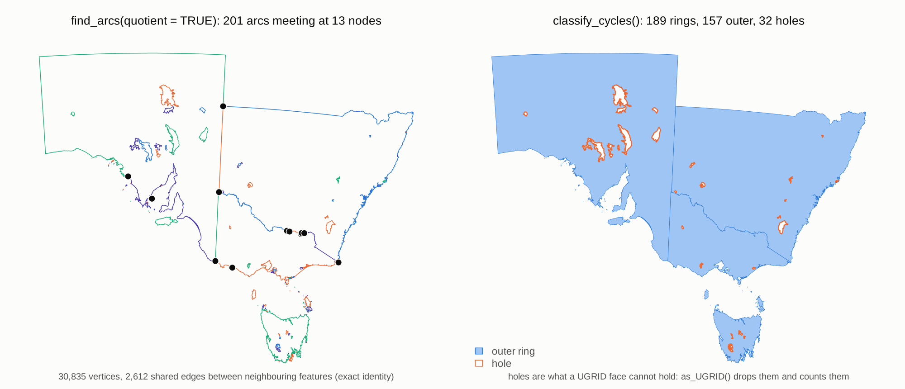
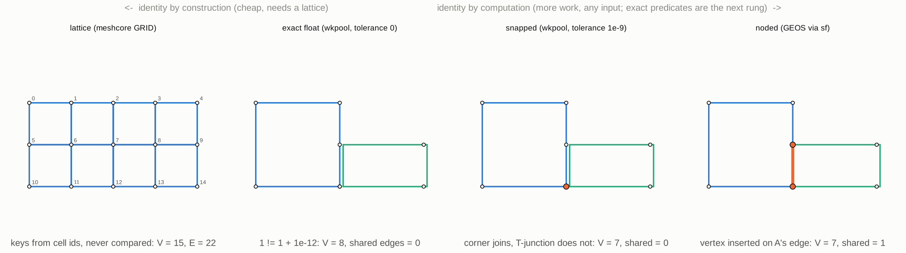

<!-- README.md is generated from README.Rmd. Please edit that file -->

```{r, include = FALSE}
knitr::opts_chunk$set(
  collapse = TRUE,
  comment = "#>",
  fig.path = "man/figures/README-",
  out.width = "100%"
) 
```

<!-- badges: start -->
[](https://github.com/hypertidy/wkpool/actions/workflows/R-CMD-check.yaml)
[](https://CRAN.R-project.org/package=wkpool)
<!-- badges: end -->
  
# wkpool

Vertex pool topology for geometry handled by [wk](https://github.com/paleolimbot/wk).

## Design philosophy

Simple features throws away topology — every polygon stores its own coordinates, shared boundaries are duplicated, and expensive operations (GEOS) are needed to rediscover this structure which is then again discarded. 

**wkpool** takes a different approach:

- **Segments are atomic**: Everything is edges (vertex pairs). Polygons, linestrings, meshes — all just segments with different grouping.
- **Vertices live in a pool**: Coordinates stored once, referenced by integer ID (`.vx`).
- **Observe, don't correct**: `establish_topology()` represents the truth of your input. Snapping/fixing is a separate, explicit decision.
- **Topology is discoverable**: `merge_coincident()` finds shared vertices. Shared boundaries, neighbour relations — they emerge from the data.
- **Feature provenance**: Segments track which feature they came from (`.feature`), enabling adjacency and boundary queries.

## Installation

From CRAN use

```r
install.packages("wkpool")
```

For development version use

```r
#install.packages("remotes")
remotes::install_github("hypertidy/wkpool")
```


## Usage

```{r usage}
library(wkpool)
library(wk)

# Any wk-handleable geometry
#x <- wk::as_wkb(<wk-compatible>)
x <- wk::as_wkb(c(
   paste0(
     "MULTIPOLYGON (((0 0, 0 1, 0.75 1, 1 0.8, 0.5 0.7, ",
     "0.8 0.6, 0.69 0, 0 0), (0.2 0.2, 0.5 0.2, ",
     "0.5 0.4, 0.3 0.6, 0.2 0.4, 0.2 0.2)))"),
 "MULTIPOLYGON (((0.69 0, 0.8 0.6, 1.1 0.63, 1.23 0.3, 0.69 0)))"
))

# Establish topology (no coordinate merging yet)
pool <- establish_topology(x)

# What do we have?
topology_report(pool)

# Merge coincident vertices (exact match)
merged <- merge_coincident(pool, tolerance = 0)

# Find shared boundaries
shared <- find_shared_edges(merged)

# Internal boundaries (edges shared by exactly 2 features)
internal <- find_internal_boundaries(merged)

# Neighbour relations
neighbours <- find_neighbours(merged, type = "edge")    # share a boundary
neighbours_v <- find_neighbours(merged, type = "vertex") # share any vertex

# Access the raw structure
pool_vertices(merged)  # data.frame: .vx, x, y
pool_segments(merged)  # data.frame: .vx0, .vx1, .feature
```

## Shared boundaries and holes

`inlandwaters` (in silicate) has six features with 189 rings, 32 of them
holes, and neighbouring states that share long boundaries vertex for
vertex. After `merge_coincident()` those boundaries are the same vertex
pairs, so the quotient graph walks each shared boundary once:

```r
x <- wk::as_wkb(sf::st_geometry(silicate::inlandwaters))
pool <- merge_coincident(establish_topology(x))
find_arcs(pool, quotient = TRUE)    # 201 arcs
find_nodes(pool, quotient = TRUE)   # 13 nodes where three or more edges meet
classify_cycles(pool)               # 189 rings: 157 outer, 32 holes
```



Without `quotient = TRUE` every vertex inside a shared boundary has
degree 4 (each feature carries its own copy of the edge), so
`find_nodes()` returns 2,619 nodes and `find_arcs()` 5,418 arcs. Use
the quotient graph for coverages; the default counts every segment.

## Vertex identity

wkpool covers two rungs of a ladder of ways a vertex can be "the same":
exact float (`merge_coincident(tolerance = 0)`) and snapped
(`tolerance > 0`). It does not node: a vertex lying on another
feature's edge stays a T-junction until something like GEOS inserts it.
Above exact float, a lattice (a raster, a discrete global grid) can give
identity by construction, with no comparison at all.



## Performance

All pipelines scale linearly. Against silicate on the same inputs
(`bench/README.md` has the full tables), wkpool is 1.6 to 29 times
faster than `PATH0()` for vertices and 12 to 1300 times faster than
`SC()` and `ARC()` for edges and arcs.


## Related

wkpool is machinery: silicate's models and `sc_*` verbs can sit on it,
and so can other mesh models. Work in progress on top of it:

- [silicate](https://github.com/hypertidy/silicate), branch `silicate2`:
  the UGRID model and a model zoo, with polygons and lines routed into
  UGRID through wkpool.
- [meshcore](https://github.com/hypertidy/meshcore) (working name):
  one verb set for rasters and discrete global grids, whose
  `as_wkpool()` hands over an already-merged pool.

## Key decisions

| Decision | Choice | Rationale |
|----------|--------|-----------|
| Pool scope | Per-vector, sidecar attribute | No wk core changes needed, n-geometry ready |
| Snapping | Observe don't correct | Represent truth, fixing is separate |
| Vertex identity | Minted `.vx` integer | Survives subset, lighter than UUID |
| Segment identity | Derived from vertex pair | No ID to track, tuple IS identity |
| Primary vctr | Segments | Geometry is what you subset, vertices follow |
| Foundation | vctrs | Principled combine/subset, tidyverse alignment |

## Next steps

- [x] `wk_handle.wkpool()`: round-trip back to wk geometry
- [x] Path reconstruction: derive linestrings/rings from segment
  connectivity
- [x] Arc-node topology and cycles, with quotient semantics for
  shared boundaries
- [x] PSLG for constrained triangulation (`as_pslg()`, RTriangle)
- [x] Vectorised verbs with no quadratic scans; C++ (cpp11) for arcs
- [ ] Apply to production package (trip)
- [ ] Triangulation integration (decido): indexed triangles from the
  same pool


## Code of Conduct
  
Please note that the wkpool project is released with a [Contributor Code of Conduct](https://contributor-covenant.org/version/2/1/CODE_OF_CONDUCT.html). By contributing to this project, you agree to abide by its terms.
